# Testing guide for Book Aarhus

## Preamble

This guide documents how to test the different features of the book_aarhus project.

The guide assumes that an [Selvbetjening](https://github.com/itk-dev/os2forms_selvbetjening) site
and a [BookAarhus](https://github.com/itk-dev/book_aarhus) site is available for testing.
An Apikey should be created in book_aarhus, that contains an apikey from selvbetjening
with access to the webform created below.

In book_aarhus run the command:
```bash
bin/console app:auth:create-apikey
```
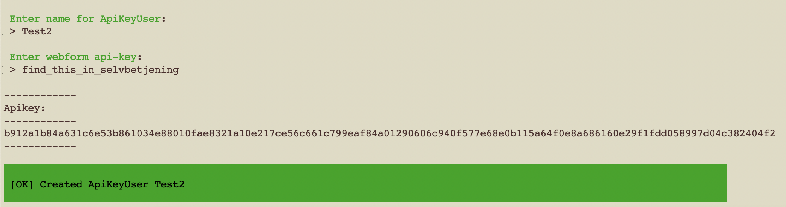

This Apikey should be used in "Setting up a booking form in Selvbetjening". Will be referenced
as `--BookAarhusApikey--`.

The `find_this_in_selvbetjening` should be replaced with the apikey from selvbetjening.
This can be found in `/da/admin/people`, by clicking "Redigér" next to the user that should
supply the access. Click "Key authentication". Use the value from "Nøgle". If no key is present
click "Generate new key".

It also assumes that both sites have their job queues running, since these handle the
communication between selvbetjening and book_aarhus.

In the local develop setup the selvbetjening queue can be run with

```bash
itkdev-docker-compose drush --uri=http://selvbetjening-nginx-1.frontend:8080 advancedqueue:queue:process os2forms_api_request_handler -vvv
```

Replace uri if the container name is different.

In the local develop setup the book_aarhus queues can be run with

```bash
docker compose exec phpfpm composer queues
```

The following scenarios are covered:

* [T1 Setting up a booking form in Selvbetjening](#t1-setting-up-a-booking-form-in-selvbetjening)
* [T2 Test create booking](#t2-test-create-booking)
* [T3 Setting up a "My Bookings" form in selvbetjening](#t3-setting-up-a-my-bookings-form-in-selvbetjening)
* [T4 Updating and deleting a booking from "My Bookings](#t4-updating-and-deleting-a-booking-from-my-bookings)

## T1 Setting up a booking form in Selvbetjening

This flow willl set up a form for creating bookings in selvbetjening.

* Navigate to selvbetjening: `/da/admin/structure/webform`.
* Press `Tilføj webform`. 
  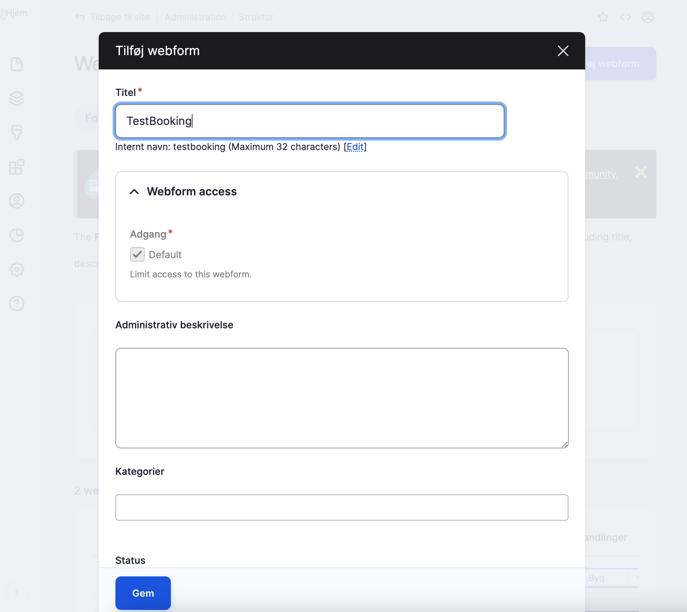
* Choose a title, e.g.  `TestBooking`. Press "Gem".
* Press `Tilføj element`. Search for `Booking`. Press `Tilføj element`.
  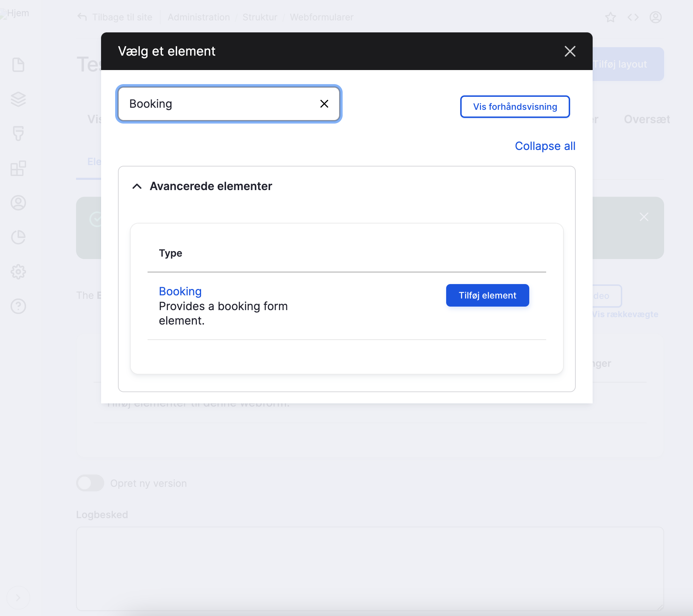
* In the sidebar choose a title, e.g. `TestBookingElement`.
  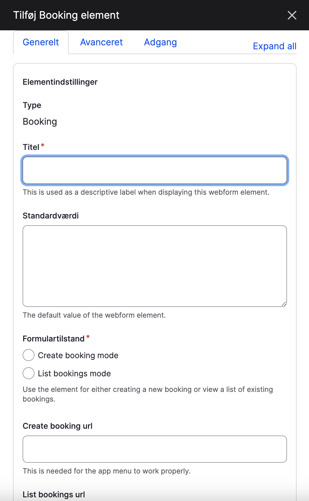
* Configure the booking element as follows:
  * Formulartilstand: "Create booking mode".
    This will configure the element to present the booking flow.
    If you choose "List bookings mode" the element will present a user's bookings.
    
  * "Create booking url" and "List bookings url" are the links on the booking page.
  * "View only (No booking)". Leave this alone. This is used for the case where TODO: Add explaination.
  * Click "Gem".
* Click "Gem elementer".
* Click "Indstillinger" -> "Emails/Handlers" -> "Tilføj behandler".
  Search for "API request handler". Click "Tilføj behandler".
* Fill "title2.
* In "API url" enter the url of the BookAarhus booking-webform url (`v1/bookings-webform`).
  For local develop setup use: `http://bookaarhus-nginx-1.frontend:8080/v1/bookings-webform`.
* In "API authorization header" enter `Apikey --BookAarhusApikey--`.
  Replace `--BookAarhusApikey--` with the key created in the Preamble.
* Click "Gem".
* Click "Vis" in the topbar. It should look like this:
  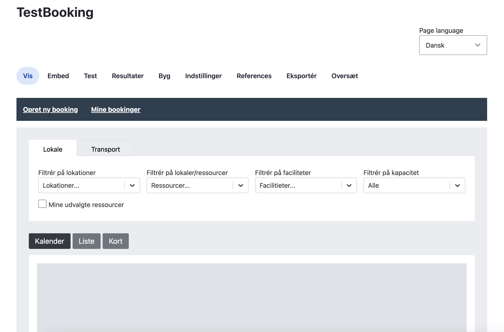

## T2 Test create booking

This flow assumes that the resource "Dokk1 Lokale Test 1" is configured for instant booking.
If the resource is configured for "Acceptance flow" the booking will have to be manually accepted in Outlook
before a mail is sent. In this case the mail will not be intercepted by Mailpit since the it is sent by an external
service.

* Click "Filtrér på lokationer".
* Select the location that the test resource is in "Dokk1 Lokale Test 1".
* Select a future time. Click "Fortsæt med dette valg".
* Fill in "Booking emne" and "E-mail". Click "Indsend".

Now the processing queues should run and deliver the result to book_aarhus API.

When the API has processed the request a mail should arrive to the email filled in above.

In the local setup BookAarhus mails will be intercepted by Mailpit.
They can be accessed with the command:

```bash
itkdev-docker-compose mail:open
```

The mail received should look like:
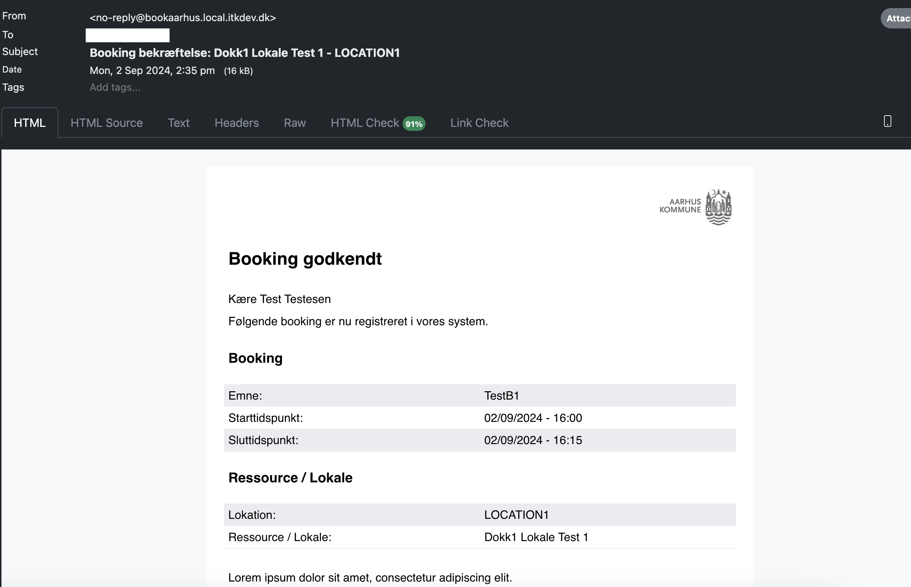


## T3 Setting up a "My Bookings" form in selvbetjening

* Navigate to selvbetjening: `/da/admin/structure/webform`.
* Press `Tilføj webform`.
  
* Choose a title, e.g.  `TestMyBookings`. Press "Gem".
* Press `Tilføj element`. Search for `Booking`. Press `Tilføj element`.
  
* In the sidebar choose a title, e.g. `TestMyBookingsElement`.
  
* Configure the booking element as follows:
  * Formulartilstand: "List bookings mode".
* Click "Gem".
* Click "Vis". It should look as follows:
  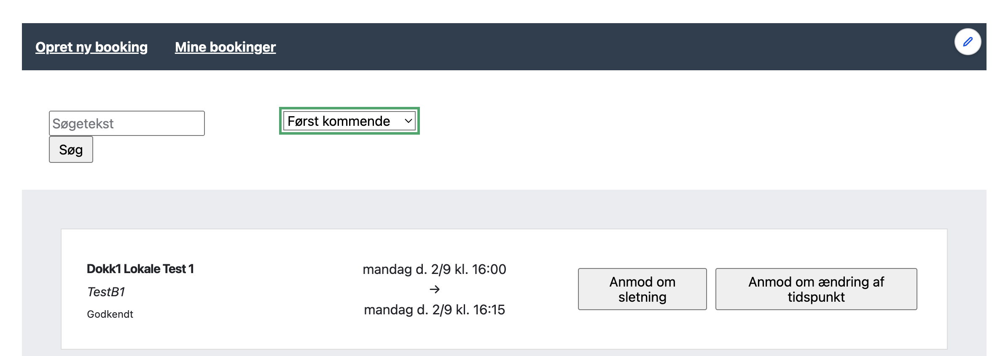

## T4 Updating and deleting a booking from "My Bookings

NB! Changes to bookings requires that the queue run in BookAarhus.

* Open the "TestMyBookings" page created in T3.
* Find the booking created in T2.
* Click "Anmod om ændring af tidspunkt".
  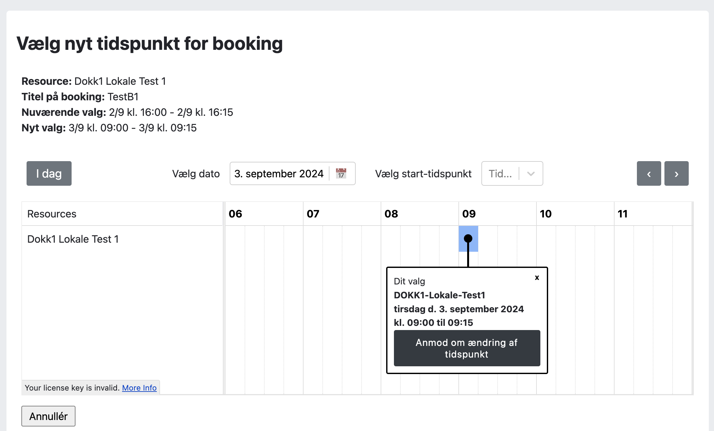
* Select a time in the future. Click "Anmod om ændring af tidspunkt".
* See that success popup appears.
  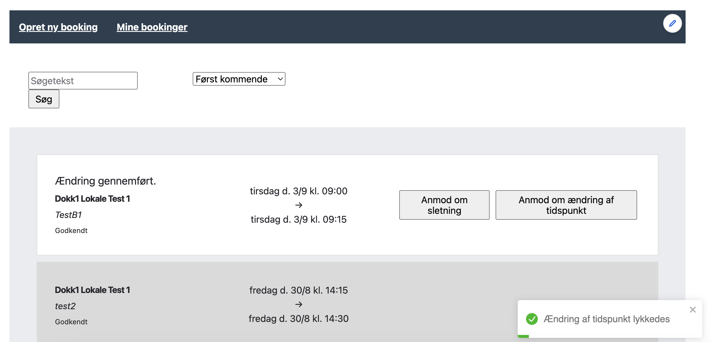
  and that the booking time has changed.

  The mail received should look like:
  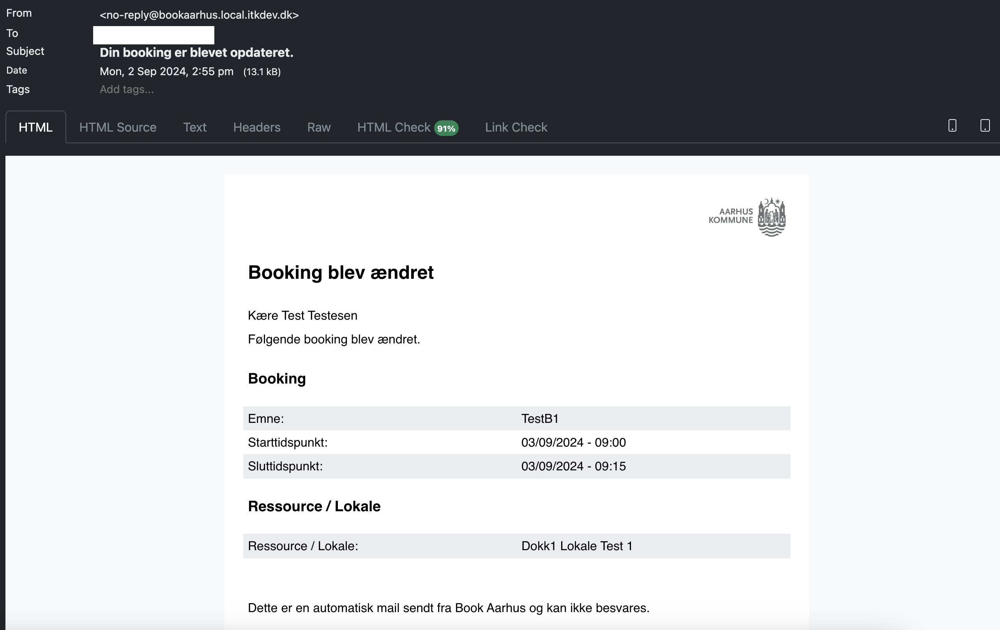
* Click "Anmod om sletning".
  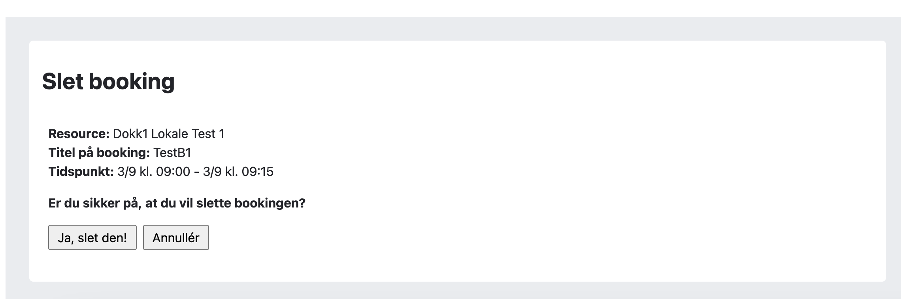.
* Click "Ja, slet den!"
* See that the succes popup appears
  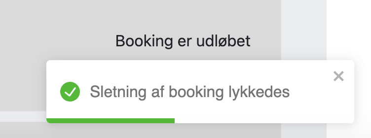
  and that the booking is not in the list anymore.

  The mail received should look like:
  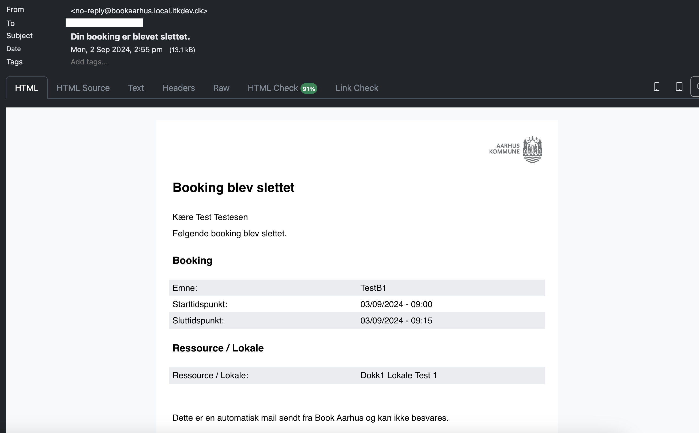
